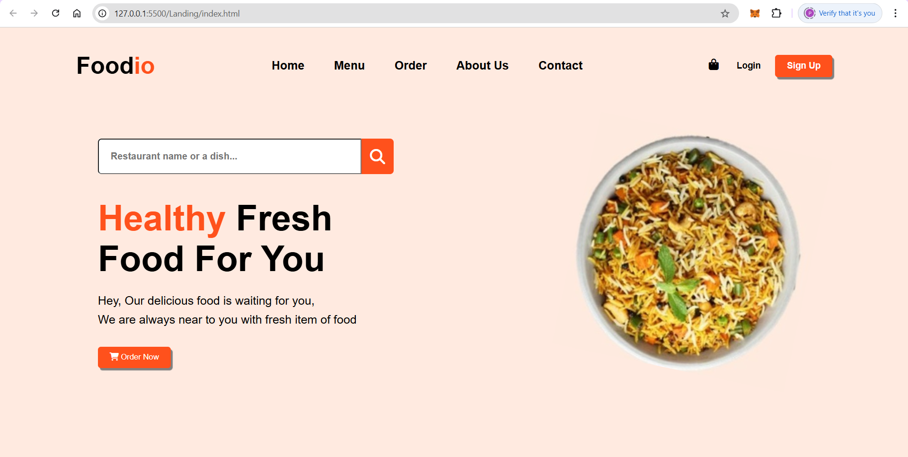

# 🍽️ Foodio - Restaurant Landing Page

**Foodio** is a modern and responsive restaurant landing page built using **HTML** and **CSS**. This static website is designed to give users a clean and appealing first impression of a food delivery or restaurant service.

---

## 🚀 Features

- 🔍 Search bar for dish or restaurant name
- 🧭 Navigation menu with links (Home, Menu, Order, About Us, Contact)
- 🛒 Call-to-action buttons like **"Order Now"** and **"Sign Up"**
- 👤 Login and signup section
- 🍛 Appealing food imagery and clean layout
- 📱 Responsive design (mobile-friendly)

---

## 📸 Screenshot

---

## 🛠️ Tech Stack

- **HTML5** – structure
- **CSS3** – styling & layout
